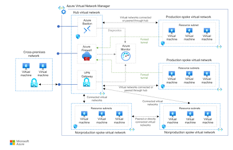

🏗️ Secure Hub & Spoke Network Architecture

This folder contains the Terraform configuration to deploy a highly secure, enterprise-grade Hub and Spoke network topology in Azure. This architecture centralizes network traffic, security inspection, and connectivity, aligning with the Microsoft Cloud Adoption Framework (CAF) and Azure Well-Architected Framework.

🎯 Business Case & Scenario

In enterprise environments, isolating workloads while maintaining centralized control over network egress, ingress, and lateral movement is critical for security and compliance.

This project demonstrates how to use Infrastructure as Code to provision a central Hub Virtual Network that hosts shared services (like an Azure Firewall) and multiple Spoke Virtual Networks for isolated application workloads. All intra-spoke and internet-bound traffic is forcefully routed through the central firewall for deep packet inspection and logging.

🗺️ Architecture Overview



Core Traffic Flow:
 - Workloads in Spoke 1 attempt to communicate with workloads in Spoke 2 or the Internet.
 - User-Defined Routes (UDRs) intercept the traffic and route it to the Azure Firewall in the Hub VNet.
 - The Azure Firewall inspects the traffic against predefined network and application rules.
 - If allowed, the traffic is forwarded to its final destination.

🛠️ Azure Resources Deployed

Hub Virtual Network: Central connectivity point.
Spoke Virtual Networks (2x): Isolated environments for workload simulation (e.g., Prod and Dev).
VNet Peering: Configured between the Hub and each Spoke (non-transitive by default).
Azure Firewall (Premium/Standard): Centralized traffic filtering and threat intelligence.
User-Defined Routes (UDRs): Custom route tables associated with Spoke subnets to force tunnel traffic to the firewall instance.
Network Security Groups (NSGs): Baseline subnet-level security.
Azure Bastion (Optional): Secure PaaS RDP/SSH access without exposing public IP addresses on VMs.

💡 Terraform Competencies Highlighted
This configuration demonstrates advanced Terraform practices, moving beyond basic resource blocks:
 - Modular Design: Separating Hub, Spoke, and Firewall deployments into reusable custom modules.
 - Data Structures: Utilizing for_each and count loops to dynamically provision multiple spokes and subnets based on variable inputs.
 - Local Variables (locals): Simplifying complex expressions and standardizing naming conventions (e.g., tagging enforcement).
 - Output Management: Passing dynamically generated resource IDs (like the Firewall Private IP) between modules for route table configuration.

🚀 Usage Instructions
Prerequisites
Terraform CLI (v1.3.0+)

Azure CLI
An active Azure Subscription with sufficient permissions (Contributor/Network Contributor).

Deployment Steps
Authenticate to Azure:
```
Bash
az login
az account set --subscription "<YOUR_SUBSCRIPTION_ID>"
```
*(Note: After connecting with 'az login', the system might show you the available subscriptions and prompt you to select one. In this case, you won't need to run the 'az account' command)*

Initialize the Directory:
Downloads the necessary AzureRM provider plugins.
```
Bash
terraform init
```

Review the Execution Plan:
Validates the configuration and displays the resources to be created.
```
Bash
terraform plan -out=hub_spoke.tfplan
```

Apply the Infrastructure:
Executes the deployment. This may take 15-25 minutes due to the Azure Firewall provisioning time.
```
Bash
terraform apply "hub_spoke.tfplan"4
```

🧹 Cleanup

To prevent ongoing Azure charges, ensure you destroy the infrastructure once the demonstration or testing is complete.
```
Bash
terraform destroy -auto-approve
```
